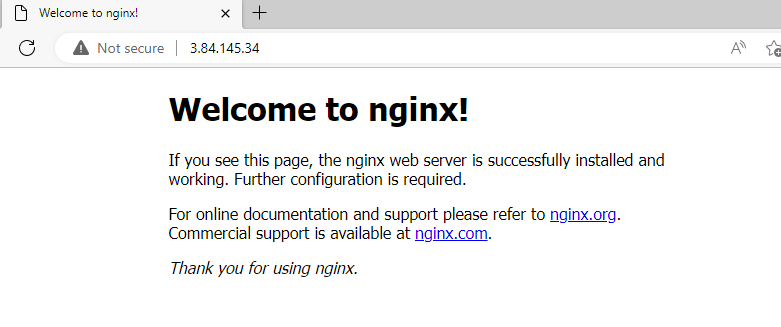
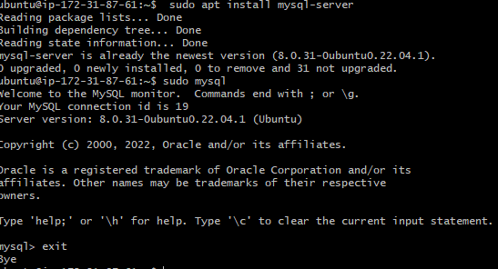
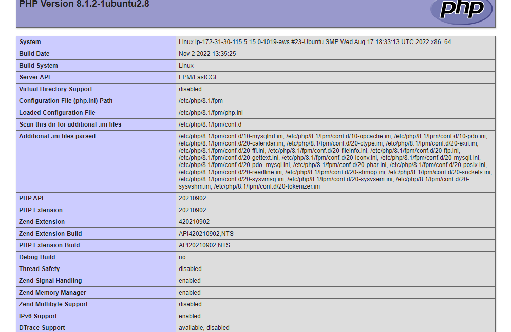
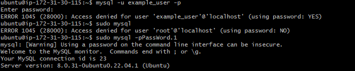
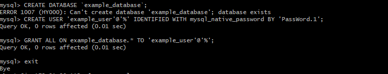
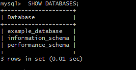
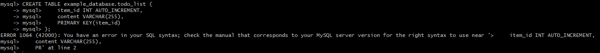
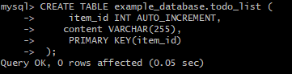
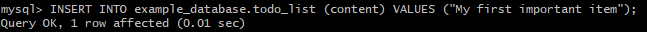
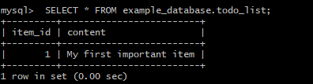

# WEB STACK IMPLEMENTATION (LEMP STACK)

Project 2 covers similar concepts as Project 1 and helps to cement your skills of deploying Web solutions using LEMP stacks.
 
 ## rusult i got while doing project 2
 

